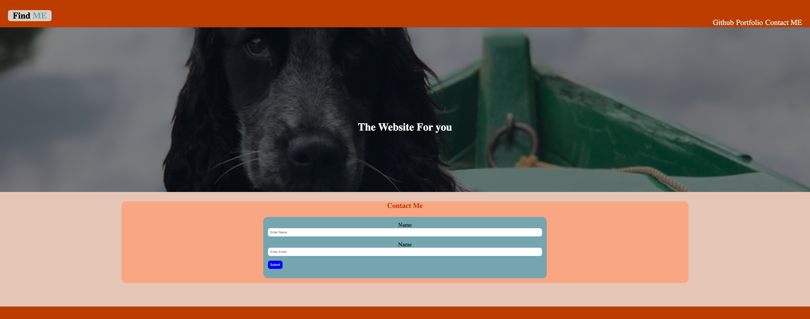

# small-project

This is a small practice project to refresh my knowledge on html and css. Where I built a simple static website with a navbar header including a hero section, a contact form section and footer.[Click to visit website]('https://dodor101.github.io/small-project/')

## Technology

- HTML
- CSS

## What I learned

I learn that it can be very difficult to work with simple css which makes me appreciate flex box and grid more. Being able to build the hero image was just the cherry on top.

## Screenshot

## Author
Dukenson Dodor